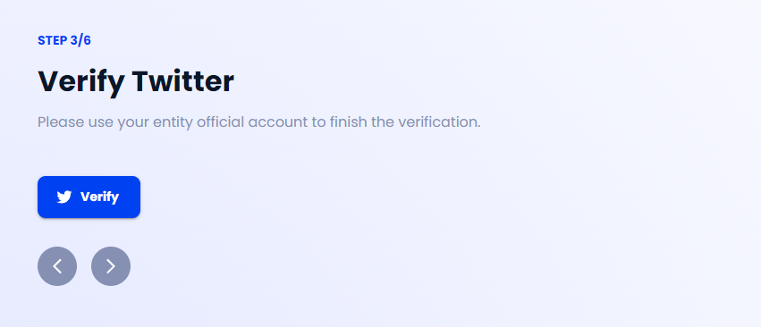
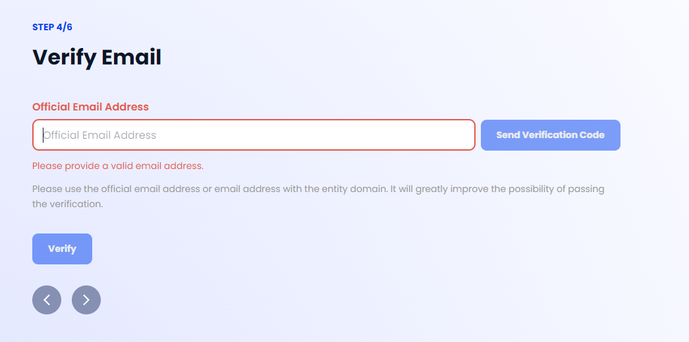

# Valid ID Onboarding Tutorials

## How to get your entity verified?

The onboarding process for entities is quite straightforward—the basic part involves a "3-element verification." The three elements include the entity's official Twitter account, official Email (or Email with the entity's official domain), and official domain name. 

Now, we will walk you through the verification process.

### Step 1 - Connect your Wallet

<figure><figcaption></figcaption></figure>

Valid ID currently supports zkID Wallet and Metamask Wallet login. In general, we recommend the DID wallet - zkID Wallet. But for organizations who already use Metamask, it is also possible to use it as the login wallet.

The entity verification result is stored in a verifiable credential. The credential will be attested by zCloak Network and other 3rd party attesters. You need to connect to your wallet to start the process.

After a successful connection, you can see the following screen. If you use Metamask, the zkID protocol will automatically generate a DID for you based on your wallet address in the form of "did:zk:0x......". This will be your unique identifier in Valid ID in the future, which is referred to as your rootkey. The key will be displayed in the top right corner.

<figure><figcaption></figcaption></figure>

### Step 2 - Fill in Entity Information

<figure><figcaption></figcaption></figure>

Entity information - entity name, entity logo, and entity introduction are required in this section.

* Please confirm that the information you fill in this section is consistent with the subsequent information.
* Please click 'Confirm' to save and submit.

### Step 3 - Verify Twitter account

<figure><figcaption></figcaption></figure>

Click 'Verify' and wait for a redirect to [twitter.com](https://www.twitter.com).

<figure><figcaption></figcaption></figure>

Click 'Authorize app' in the pop-up to automatically verify the Twitter account.&#x20;

> Note: Please log into the entity's official Twitter account beforehand in order to pass the verification.

<figure><figcaption></figcaption></figure>

### Step 4 - Verify Email account

<figure><figcaption></figcaption></figure>

Type in your official email address in the box and click 'Send Verification Code'.&#x20;

You will receive a 6-digit verification code in your inbox. If you can't find the email in your inbox, kindly check the spam folder as well.

<figure><figcaption></figcaption></figure>

Fill in the 6-digit verification code, then click 'Verify'.

<figure><figcaption></figcaption></figure>

### Step 5 - Verify Domain Name

<figure><figcaption></figcaption></figure>

Enter your domain name in the input box and click 'Start Verification'.

<figure><figcaption></figcaption></figure>

#### Step 5.1

Click 'Generate Signature'. In this process, you use your rootkey to sign a challenge message and link the signature with your domain name by using the domain TXT record.

#### Step 5.2

Click 'Copy' to copy your signature.

#### Step 5.3

Add the signature as a TXT record to your domain to prove you own it.


**How to add the signature?**

You can create a new record and set this signature as the value in the Domain Name you input. We share a similar verification process with Google Workspace. You can refer to [Verify your Domain Name](https://support.google.com/a/topic/1409901?hl=en\&ref\_topic=9196) or [DNS record for site ownership verification](https://www.youtube.com/watch?v=C\_0FSgVgqnc) to find your Domain Name service provider and follow the guide to add TXT record.


#### Step 5.4

After adding the signature to your domain.Tick 'I have added this signature to domain TXT record' and click 'Verify'.

### Step 6 - Review and Submit

<figure><figcaption></figcaption></figure>

Please carefully review all the information you provided in step 2\~5. You can check unfinished steps and edit or re-verify any information in this step.

* Please ensure that the Twitter account, email, and domain name all come from the same entity, and the name of the entity is consistent with the entity name you filled in.
* The Beta version of Valid ID does NOT support editing after submission. Please confirm all information is correct.
* It will take around 1-3 working days to finish the verification.
* We provide a 1-year credential for all entities in Valid ID platform's beta version. Please be aware of this and keep in mind the expiration time.

### Get the Result

After finishing the steps above, the result will be sent to you by the attester within 1-3 working days.**Passed:**

* You will receive a verified **** credential: the **Entity Basic Info** credential.
* Your entity will be listed on the verified entity page.
* You can also fill in further information about your entity on the 'My Profile' page. (eg. Ethereum address...)

**Failed:**

* You **won't** receive the **Entity Basic Info** credential.
* You can re-submit the request for attestation again in 'My Credential', after making sure all information is consistent and correct.
* You can reach us at info@zcloak.network for further information.
